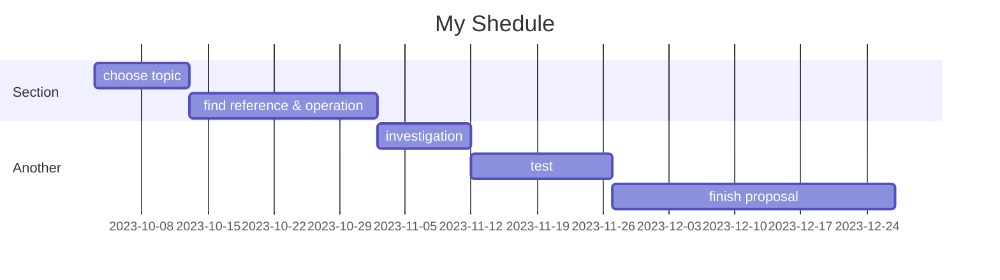
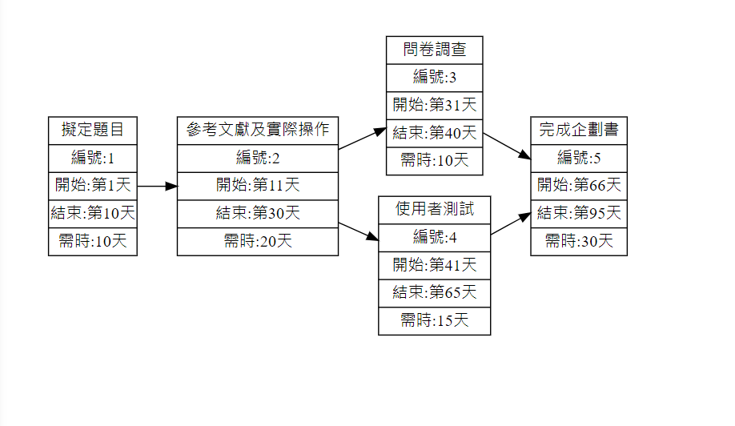

# 專案管理

## 甘特圖

```mermaid
gantt
    title My Shedule

    section Section
    choose topic     :a1, 2023-10-03, 10d
    find reference & operation   :a2, after a1  , 20d

    section Another
    investigation   :a3 , after a2  , 10d
    test            :a4,after a3 , 15d
    finish proposal :after a4 , 30d
```
[更多關於 **mermaid** 語法 <i class="fa fa-external-link"></i>](http://mermaid-js.github.io/mermaid)
&nbsp;
&nbsp;

---

## PERT/CPM圖

## 關鍵路徑
1 -> 2 -> 4 -> 5
